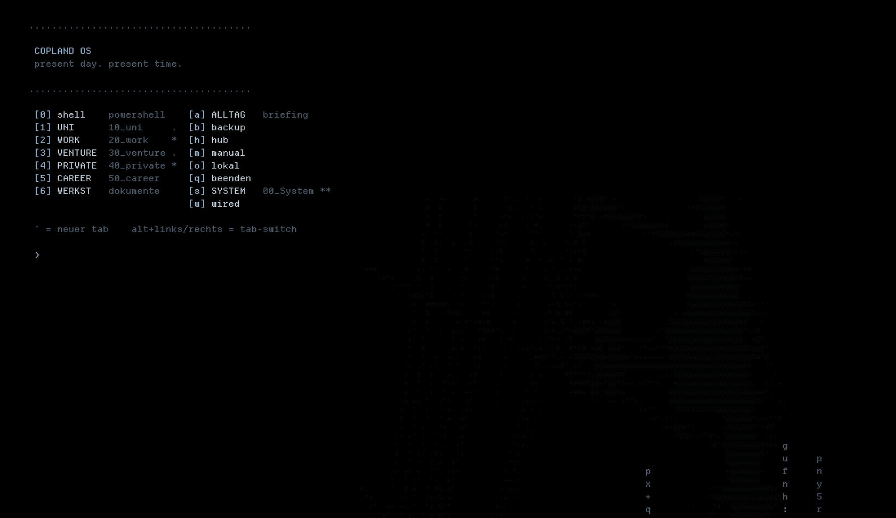
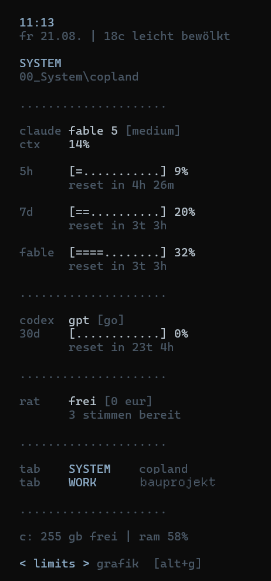
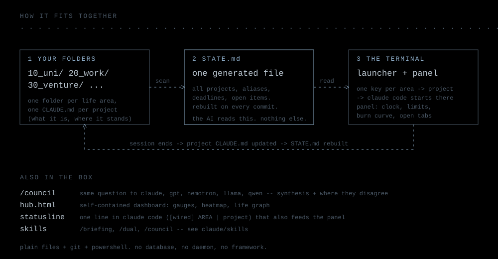

> present day. present time.

A terminal-centered personal operating environment for working with AI assistants.
Pure black, cold blue-gray, pure ASCII, function over decoration.

The name and the look come from *Serial Experiments Lain* (1998): Copland OS is the
operating system on Lain's Navi. This is a homage, not an affiliation.

Built by **Marko Piric**.

*The launcher: life areas, tools, admin, ambient -- one key each. Nothing else on screen.*

    lebensbereiche                   werkzeuge                        admin                            ambient

    [1] uni      10_uni        **    [a] alltag   60_assistent  **    [s] system   00_System     **    [u] musik
    [2] work     20_work       .     [g] general  80_general    *     [p] mcp      70_mcp              [w] wired
    [3] venture  30_venture          [h] hub                          [c] chats                        [o] lokal
    [4] private  40_private    .     [v] vault                        [b] backup                       [0] shell
    [5] career   50_career                                            [m] manual                       [q] beenden
    [6] werkst   dokumente

    [enter] > system / copland        vor 3m
              uni / vorkurs           vor 1h
              general                 vor 2h
              work / rechnungen       gestern

    ** heute   * gestern   . diese woche   pfeil hoch/runter = letzter chat   ^ = neuer tab   alt+links/rechts = tab

## Why

Five life areas, two dozen projects, one head. Every AI session used to start with
"where were we?". Copland OS makes the folder structure itself the memory: the
launcher knows the areas, every project carries its context, and a single generated
file tells the AI what is going on everywhere. You press one key and are back inside
the right project with the right context -- nothing to explain.

## Install: one line

Paste into a terminal -- that is all. It fetches git + Claude Code if missing,
clones this repo to `~/copland-os` and opens Claude inside it:

| | |
|---|---|
| **Windows** (PowerShell) | `irm https://raw.githubusercontent.com/murkprcai-tech/copland-os/main/get.ps1 \| iex` |
| **macOS / Linux** | `curl -fsSL https://raw.githubusercontent.com/murkprcai-tech/copland-os/main/get.sh \| bash` |

Claude then **asks** before it scans anything (read-only), proposes your life
areas as a table, and builds folders, context files, launcher and panel only
after you say go. Nothing is moved without your ok, nothing is ever deleted.

## First run: let Claude build your structure

Open this repo in Claude Code (`claude` inside the cloned folder). The repo's
`CLAUDE.md` tells Claude to offer a guided setup: it scans your home and cloud
folders **read-only**, proposes life areas and a home for every existing project
as a table, and -- only after you say go -- creates the folders, one `CLAUDE.md`
per project, the root constitution, the launcher, and `STATE.md`. Nothing is
moved without a row you confirmed; nothing is ever deleted. Say `/setup` to start
it by hand.

## What it is

Copland OS turns a terminal + PowerShell + [Claude Code](https://claude.com/claude-code)
(Windows Terminal on Windows, WezTerm on macOS/Linux -- same scripts, same keys)
into a launcher for your whole life: numbered *life areas* (university, work, ventures,
private, career) live as folders, every project carries a context file for the AI,
and a single keypress drops you into an AI session exactly where you left off.

## Features

- **Launcher** -- four columns: *life areas* | *tools* | *admin* | *ambient*.
  One key per area, activity pulse (`**` today, `*` yesterday, `.` this week),
  the last four chats listed under the menu -- arrow up/down picks one, `[enter]`
  resumes it inside its project folder -- digital rain, project cards with
  last-activity and status
- **General chat `[g]`** -- a thinking room. Dump thoughts, ideas, half sentences;
  every one lands as a line in `80_general/inbox.md`. The nightly harvest sorts
  them into the brain, the area vaults, open items or deadlines and keeps a log
  (`inbox-verarbeitet.md`); anything unclear stays in the inbox marked `?area`
- **Panel** -- a slim live sidebar in every tab: clock, weather, Claude/Codex/free-AI
  usage limits as bars, burn-rate curve (braille), sixel graphics page
  (token curves, model split, activity heatmap), open tabs, a Spotify page
  (media-session control, no API key) -- switch pages with arrow keys or `alt+g`

  

- **STATE.md generator** -- machine-readable snapshot of all projects, aliases,
  deadlines and cross-project links, grouped by level (life areas / tools);
  the AI reads your whole world in one file
- **Chats `[c]`** -- every Claude Code session like the chat list in the app,
  grouped by life area: age, prompt count, size, and whether the day was already
  distilled into the brain. Resume any of them, or delete to a recycle folder --
  with an optional *context check* first (Claude reads the chat and saves what
  is still worth knowing)
- **Vault `[v]`** -- one Obsidian-compatible knowledge vault per life area, edited
  in the terminal: one screen (list | note | context), live filter, wikilinks,
  backlinks, daily notes, ASCII graph, browser force-graph, semantic search and
  link suggestions via a local embedding model (Ollama). Cross-vault links resolve
- **Hooks** (node, no npm) -- a *guard* that blocks writes to taboo paths (cloud
  mounts, password files, secrets, deletes in protected areas) while reading stays
  free; an *audit log* of every write action; *toast + sound* when Claude needs
  you; *vault recall* that silently adds the three most relevant notes to each prompt
- **Daily harvest** -- once a day the launcher distils yesterday's sessions into a
  small cross-project *brain* (people, decisions, preferences, open threads,
  deadlines) so nothing depends on old chats staying around; the same run sorts
  the general-chat inbox
- **Hub** -- terminal dashboard + self-contained HTML command center
  (gauges, donut, heatmap, force-directed life graph, commit timeline);
  **Connections `[p]`** -- what MCP servers, connectors and CLIs are wired, where a login is missing
- **The Council (`/rat`)** -- ask Claude, GPT, NVIDIA Nemotron, Meta Llama and
  Alibaba Qwen the same question in parallel, get a synthesis plus a
  "where they disagree" block; the extra voices run on free API tiers (0 EUR)
- **Ambient mode** -- fullscreen clock + limits + rain when you are not working;
  **Spotify `[u]`** -- fullscreen player with braille visualizer

## How it fits together

Everything is plain files: folders are life areas, each project carries a `CLAUDE.md`,
a generator folds all of them into one `STATE.md`, and the AI reads that single file
to know where you are. No database, no daemon, no framework.

## What is in the box

Everything that makes the environment feel like one thing, not five tools:

- the **launcher + panel** (terminal), **STATE.md** generator, **hub**, **chats**,
  **vault**, the **daily harvest** and the **hooks** (guard, audit, notify, vault recall)
- the **answer style** -- `claude/output-styles/concise.md` + `templates/GLOBAL-CLAUDE.md`:
  short, essence first, no filler. `/setup` offers to install it
- the **constitution** and project templates (`templates/`) -- the rules that keep
  folders and context files consistent
- the **skills** below, and the **council helper** for free second opinions
- **optional connections** the setup asks for: Codex CLI, local models via Ollama
  (`[o]`), free council keys, calendar/mail connectors, sixel graphics. The panel
  only shows what is connected -- nothing configured, nothing displayed

## Skills (built in)

Five Claude Code skills ship in `claude/skills/` -- the installer copies them to `~/.claude/skills/`:

| skill | what it does |
|---|---|
| `/setup` | first run: scan (read-only), propose areas + project homes, build folders and `CLAUDE.md`s, install everything |
| `/briefing` | calendar, mails that need action, deadlines, open items, last work -- one screen |
| `/dual` | same task to Claude and Codex (GPT) in parallel, one synthesised answer |
| `/council` | same question to Claude, GPT, Nemotron, Llama, Qwen -- synthesis + where they disagree (free tiers) |
| `/notiz` | write or extend a knowledge note in the vault of the current life area (wikilinks, backlinks) |

## Requirements + install

One installer, every platform -- the scripts detect the system at runtime:

| | run inside the cloned repo |
|---|---|
| **Windows 11** (PowerShell 5.1+, Windows Terminal) | `powershell -ExecutionPolicy Bypass -File setup/install.ps1` |
| **macOS** (Homebrew) | `bash setup/macos.sh` -- installs pwsh 7, WezTerm, Departure Mono, then the same installer |
| **Linux** (pwsh 7) | `pwsh -File setup/install.ps1` |

- [Claude Code](https://claude.com/claude-code) (and optionally the Codex CLI)
- Font: [Departure Mono](https://departuremono.com/) (or any mono font you like)
- [Node.js](https://nodejs.org) for the hooks (guard, audit, notify, vault recall) -- plain node, no npm packages
- Optional: `ccusage` (npm) for token charts, [Sixel](https://www.powershellgallery.com/packages/Sixel)
  PowerShell module (Windows Terminal >= 1.22), Ollama for offline models and the vault's semantic search

Root folder defaults to `~/OneDrive` (if it exists) or `~/copland`; `-Root <folder>`
or `COPLAND_ROOT` for anything else. Details and the manual route: [SETUP.md](SETUP.md).

## Repository layout

    copland/   launcher, panel, state/hub/mcp generators, chats, vault (+ browser graph template),
               daily harvest, spotify, council helper, manual; hooks/ (guard, audit, notify, vault-recall, toast)
    claude/    statusline scripts, color theme, output-styles/concise.md, skills/ (setup, briefing, dual, council, notiz)
    templates/ ROOT-CLAUDE.md (constitution), PROJECT-CLAUDE.md (project context), GLOBAL-CLAUDE.md (answer style)
    setup/     install.ps1 (all platforms), macos.sh (brew bootstrap), wezterm.lua
    docs/      screenshots (launcher, panel), animated banner, architecture diagram (svg)

## License

MIT (c) Marko Piric -- see [LICENSE](LICENSE).
